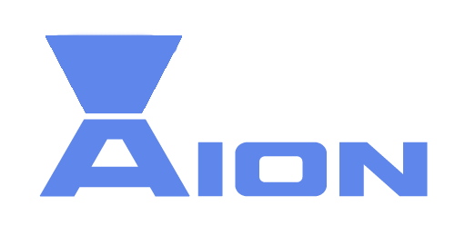

<div align="center">

</div>

# The Aion language

> [!CAUTION]
> The language is under development, and doesn't yet works.


Aion is DSL language for managing ICalendar(.ics) files. The official page of Aion language can be found at https://aionlang.github.io/. 

This repository contains all the necessary tools for and executing `Aion` source files in different ways (clone and run `npm i` before using it).


## Resources

- **Executables**: https://aion-ics.github.io/downloads.html
- **Documentaion**: https://aionlang.github.io/documentation.html 
- **Repository**: https://github.com/aionlang/aion
## Using Aion

**OPTION 1:** As npm library

You can install the latest version of Aion for use in Node-js environments using the command:

```bash
npm install aion-ics
```

Then, in your TS or JS file you can use it as a CJS or ESM module

```typescript
import * from "aion-ics"
// or
const Aion = require("aion-ics")
```


All the instructions regarding npm-specific use of Aion can be found at [docs\use\NPM.md](docs\use\NPM.md)

---

> [!NOTE]  
> Other option are specific for CLI and it's different applications. And requires local set-up of the langauge. Refer to [docs\use\LOCAL.md](docs\use\LOCAL.md) to get instructions.

**OPTION 2:** Install Aion using `Aion-setup.exe`

(coming soon) 


**OPTION 3:** Run CLI from this repository

1) Clone the repository, install the dependencies

```bash
mkdir aion
cd aion
git clone https://github.com/aionlang/aion
npm i
```

2) Then, to compile and run an `.aion` file, you run

```
npm run cli aion_file.aion
```

The `.aion` file path should be relative to root folder or absolute. 

**OPTION 4:** Create executables from this repository. 

You can build Aion language directly from this repository, following these instructions:

```
npm run make-win
(or)
npm run make-platform
(or)
npm run make-platform
```

The target executable is located at `exe/executables/{platformname}`

**OPTION 5:** Build the installer

You can build the installer using Inno setup script. For more information, visit `exe/win-installer` folder with build [instructions](exe/win-installer/README.md)


## Source code organization

The Aion language repository is organized in following way:


| Directory         | Contents                                                           |
| -                 | -                                                                  |
| `src/`           | the root directory of source files |
| `src/cli/`            | command line interface entry point folder                       |
| `src/index/`        | npm package entry point folder                                          |
| `docs/examples/`        | some examples of `Aion` files                                      |
| `docs/`            | contains `/examples` and grammar in BNF form                                             |
| `exe/`            | contains `/executables` and win-installer build instructions                                            |


## Language grammar

The grammar of the language in Backus Naur Form (BNF) is avaliable in [docs folder](docs/grammar_BNF.md)

## Examples of Aion 

Further examples, and the full documentation is avaliable at Aion [website](https://aion-ics.github.io/). 