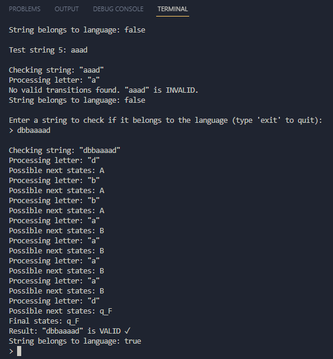
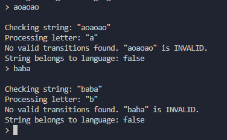

# Topic: Intro to formal languages. Regular grammars. Finite Automata.

### Course: Formal Languages & Finite Automata
### Author: Ilico Artemie

----

## Theory
A formal language can be considered to be the media or the format used to convey information from a sender entity to the one that receives it. The usual components of a language are:

-The alphabet: Set of valid characters;
-The vocabulary: Set of valid words;
-The grammar: Set of rules/constraints over the lang.
    Now these components can be established in an infinite amount of configurations, which actually means that whenever a language is being created, it's components should be selected in a way to make it as appropriate for it's use case as possible. Of course sometimes it is a matter of preference, that's why we ended up with lots of natural/programming/markup languages which might accomplish the same thing.
Formal languages are a fundamental concept in theoretical computer science, playing a crucial role in automata theory, compiler design, and natural language processing. A formal language consists of a set of strings formed from a defined alphabet and follows specific rules or grammar.

Regular grammars are a subset of formal grammars that describe regular languages. They are defined using a set of production rules that determine how strings in the language can be generated. Regular grammars can be either right-linear or left-linear, where non-terminal symbols appear either at the beginning or end of a production rule, respectively.

Finite Automata (FA) are abstract computational models used to recognize regular languages. They consist of a finite set of states, a defined alphabet, transition functions, an initial state, and one or more accepting states. There are two main types of finite automata:

Deterministic Finite Automaton (DFA): Each state has a unique transition for each symbol in the alphabet.

Non-Deterministic Finite Automaton (NFA): A state may have multiple transitions for a single input symbol, including epsilon (ε) transitions.

Finite automata are widely used in lexical analysis, pattern matching, and network protocols, making them essential for understanding formal language processing.

## Objectives:

1. Discover what a language is and what it needs to have in order to be considered a formal one.
2. Provide the initial setup for the evolving project that you will work on during this semester. You can deal with each laboratory work as a separate task or project to demonstrate your understanding of the given themes, but you also can deal with labs as stages of making your own big solution, your own project. Do the following:
    - Create GitHub repository to deal with storing and updating your project;
    - Choose a programming language. Pick one that will be easiest for dealing with your tasks, you need to learn how to solve the problem itself, not everything around the problem (like setting up the project, launching it correctly and etc.);
    - Store reports separately in a way to make verification of your work simpler;
3. According to your variant number, get the grammar definition and do the following:
    - Implement a type/class for your grammar;
    - Add one function that would generate 5 valid strings from the language expressed by your given grammar;
    - Implement some functionality that would convert an object of type Grammar to one of type Finite Automaton;
    - For the Finite Automaton, please add a method that checks if an input string can be obtained via the state transition from it;


## Implementation description

The implementation consists of **three main files**:

1.  `Main.ts`: Entry point of the program.
    
2.  `Grammar.ts`: Defines the grammar structure and generates valid words.
    
3.  `FiniteAutomaton.ts`: Defines the finite automaton and checks if a string belongs to the language

Key Parts: 

- Grammar components

```
The grammar is defined based on **Variant 17**:
const vN = new Set(["S", "A", "B", "C"]); // Non-terminals
const vT = new Set(['a', 'b', 'c', 'd']); // Terminals
const p = new Map<string, string[]>([    // Production rules
    ["S", ["dA"]],
    ["A", ["aB", "bA"]],
    ["B", ["bC", "aB", "d"]],
    ["C", ["cB"]]
]);
const s = "S"; // Start symbol
```
- String Generating by Grammar (PSEUDOCODE)

```
function createWord():
    word = StartSymbol
    while word contains non-terminals:
        Pick a random non-terminal in word
        Replace it with one of its possible productions
    return word
```

- Grammar convertion to FA (PSEUDOCODE)

```
function toFiniteAutomaton():
    Create set of states (Q) from non-terminals
    Add final state (qF)
    Create transition map (delta)
    For each production rule:
        Extract terminal symbol
        Extract target state (non-terminal)
        Add transition rule: current state → (terminal) → next state
    Return new FA
```

- String Recognition

```
for (const letter of inputString) {
    if (!this.Sigma.has(letter)) return false;
    const nextStates = new Set<string>();
    for (const state of currentStates) {
        if (this.Delta.has(state) && this.Delta.get(state)!.has(letter)) {
            const possibleStates = this.Delta.get(state)!.get(letter)!;
            possibleStates.forEach((s) => nextStates.add(s));
        }
    }
    if (nextStates.size === 0) return false;
    currentStates = nextStates;
}
return currentStates.has(this.QF);
```

## Conclusions / Screenshots / Results

- Here we can observe the output:

```
PS C:\Users\artem\OneDrive\Рабочий стол\LFA> ts-node Main.ts
Laboratory Work 1: Intro to formal languages. Regular grammars. Finite Automata.

Student: Ilico Artemie
Group: FAF-231
Variant 17

Grammar:
V_N = { S, A, B, C }
V_T = { a, b, c, d }
P = {
    S ---> dA
    A ---> aB | bA
    B ---> bC | aB | d
    C ---> cB
}
S = { S }


5 valid strings by grammar:

String 1:

Generating word: S
 => dA
 => daB
 => dad
Final string: dad

String 2:

Generating word: S
 => dA
 => dbA
 => dbbA
 => dbbaB
 => dbbaaB
 => dbbaabC
 => dbbaabcB
 => dbbaabcbC
 => dbbaabcbcB
 => dbbaabcbcbC
 => dbbaabcbcbcB
 => dbbaabcbcbcbC
 => dbbaabcbcbcbcB
 => dbbaabcbcbcbcaB
 => dbbaabcbcbcbcabC
 => dbbaabcbcbcbcabcB
 => dbbaabcbcbcbcabcd
Final string: dbbaabcbcbcbcabcd

String 3:

Generating word: S
 => dA
 => dbA
 => dbaB
 => dbabC
 => dbabcB
 => dbabcbC
 => dbabcbcB
 => dbabcbcaB
 => dbabcbcabC
 => dbabcbcabcB
 => dbabcbcabcbC
 => dbabcbcabcbcB
 => dbabcbcabcbcd
Final string: dbabcbcabcbcd

String 4:

Generating word: S
 => dA
 => daB
 => daaB
 => daaaB
 => daaaaB
 => daaaaaB
 => daaaaabC
 => daaaaabcB
 => daaaaabcd
Final string: daaaaabcd

String 5:

Generating word: S
 => dA
 => dbA
 => dbbA
 => dbbaB
 => dbbaaB
 => dbbaaaB
 => dbbaaaaB
 => dbbaaaad
Final string: dbbaaaad

Testing random strings with the Finite Automaton:

Test string 1: acccc

Checking string: "acccc"
Processing letter: "a"
No valid transitions found. "acccc" is INVALID.
String belongs to language: false

Test string 2: dcbddcdc

Checking string: "dcbddcdc"
Processing letter: "d"
Possible next states: A
Processing letter: "c"
No valid transitions found. "dcbddcdc" is INVALID.
String belongs to language: false

Test string 3: cbabacbbd

Checking string: "cbabacbbd"
Processing letter: "c"
No valid transitions found. "cbabacbbd" is INVALID.
String belongs to language: false

Test string 4: ccccccbdd

Checking string: "ccccccbdd"
Processing letter: "c"
No valid transitions found. "ccccccbdd" is INVALID.
String belongs to language: false

Test string 5: aaad

Checking string: "aaad"
Processing letter: "a"
No valid transitions found. "aaad" is INVALID.
String belongs to language: false

Enter a string to check if it belongs to the language (type 'exit' to quit):
>

```

- Manual input






## References
[1] DSL_laboratory_works: Intro to formal languages. Regular grammars. Finite Automata. - Crețu Dumitru, Drumea Vasile, Cojuhari Irina - https://github.com/filpatterson/DSL_laboratory_works/blob/master/1_RegularGrammars/task.md
